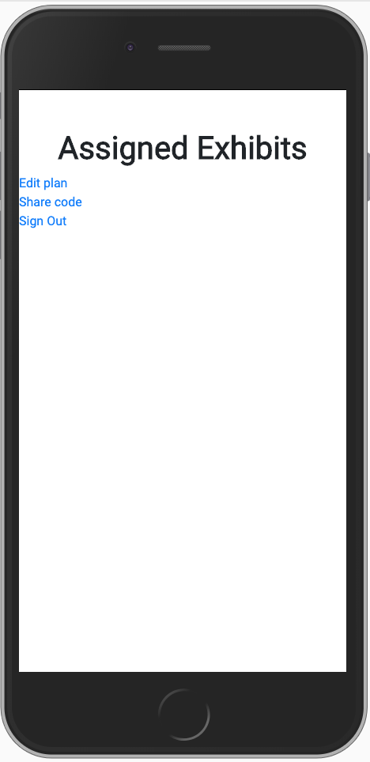

# UCSD COGS 121 Spring 2019 Project - Milestone 2
## Team name
Band of the Hawk
## Team members
Eddy Ambing
Tianyu Ma
Kenny Cheng
Andrew Auh
## Differences from Milestone 1 proposal
We will be using PetsApp v2 as a basis for our project.
It is found at: https://github.com/pgbovine/COGS121/tree/master/petsapp-v2

Based on our TA feedback, we will be continuing with our original idea of the app, and basing it off of both Prototypes 1 & 2.
## Screenshots of UI

  
"Educator" Path  

  
"Student" Path  

### How the screenshots differ from Milestone 1 proposal
Our screenshots are fairly direct adaptations of both of our paper prototypes. While we maintained the general flow and many UI elements from our second prototype, we also included some of the features present in our first prototype -- namely the map component which seemed like a useful visual tool for our users. As a result, our most recent UI contains components of both of our initial prototypes. 

## Plan of data sets
We will be sticking to our original idea from Milestone 1, and using the Harvard Art Museum API: https://github.com/harvardartmuseums/api-docs.
