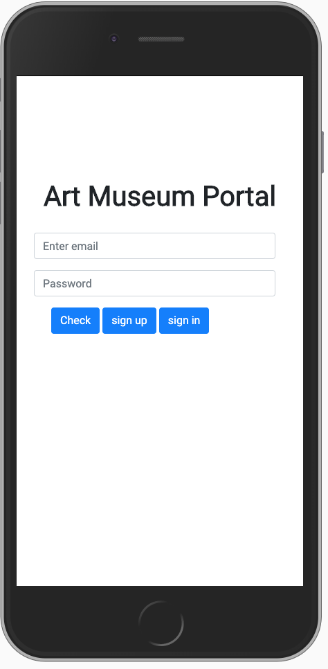
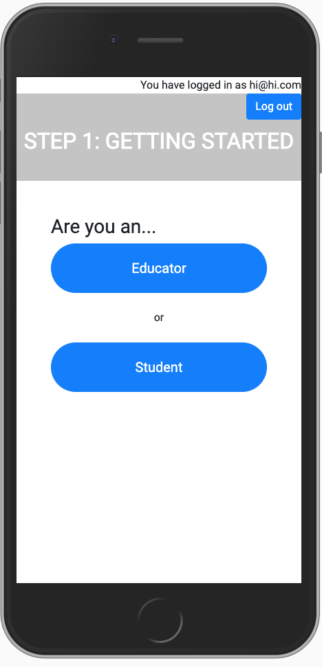
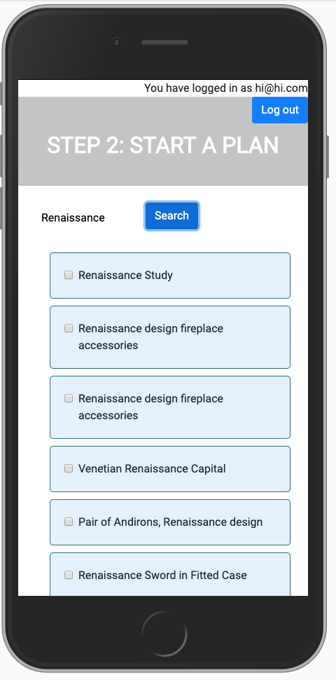
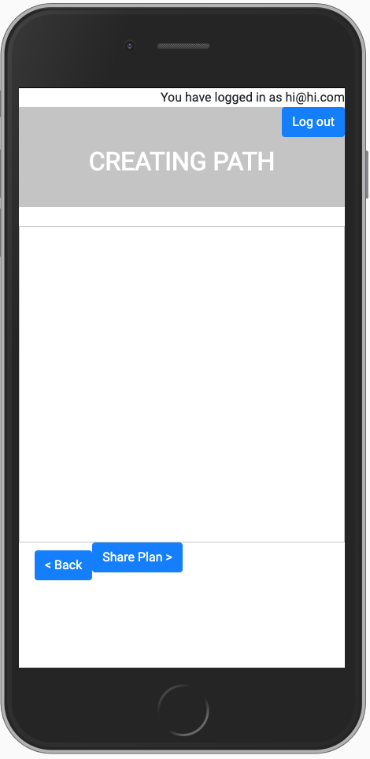
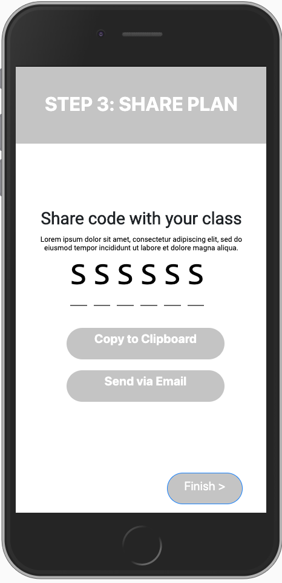
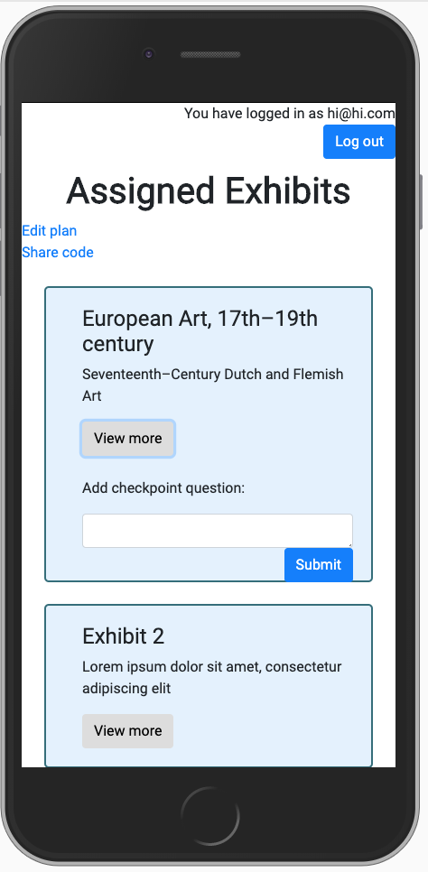
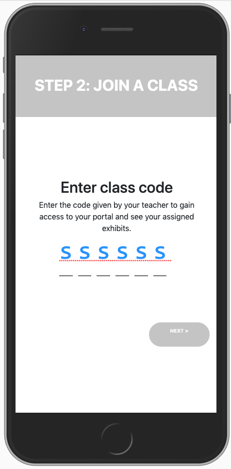
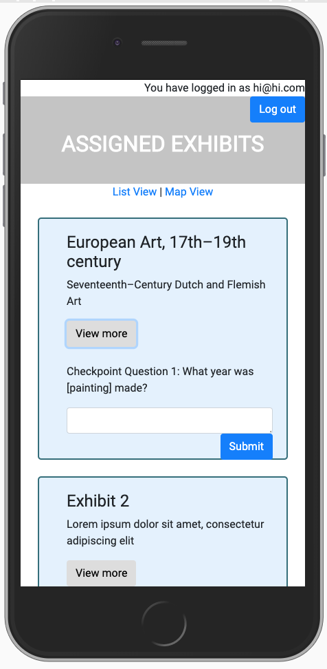

# UCSD COGS 121 Spring 2019 Project - Milestone 3
## Team name
Band of the Hawk
## Team members
Eddy Ambing
Tianyu Ma
Kenny Cheng
Andrew Auh
## Screenshots of UI & Improvements from Milestone 2

  
"Educator" Path  

  
"Student" Path  

## Differences with Milestone 2
While the majority of our frontend skeleton was developed in our previous milestone, the changes we made in our UI for this week included fixing styling tweaks and changing some of our placeholder text to incorporate data from our API. This latter change is most evident on the "Start a Plan" page, where the user can search through the museum database to find particular items. In addition, we made styling changes to provide more consistency and make information more visible and organized, while also implementing the frontend of a "Checkpoint Question" feature in both the student and educator portals. We envision this feature being something that teachers can use to enable learning and engagement with their students. 

## Data API
For our project, we are using the Harvard Art Museum API: https://github.com/harvardartmuseums/api-docs.
We've found that this API contains a comprehensive amount of data that we think could be useful for our project. In particular, this API provides contains detailed information about works of art in the museum, spanning from general information about art pieces (title, artist, date, historical period, etc.) to where it can be located in the facilities.
