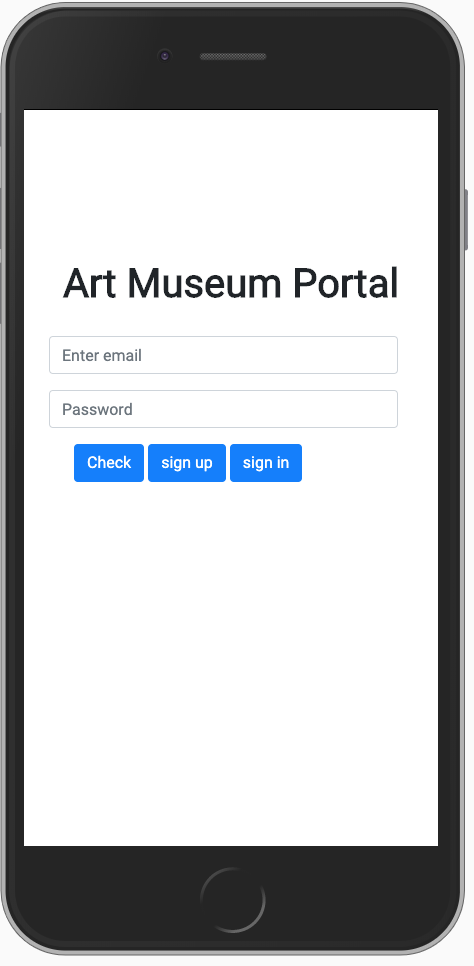
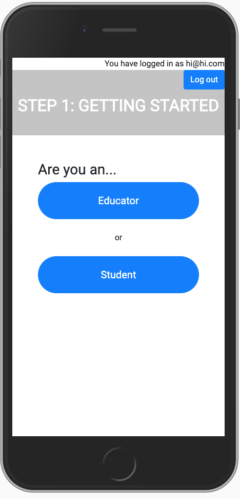
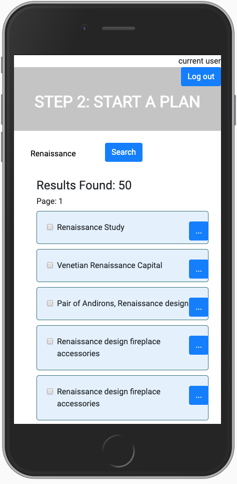
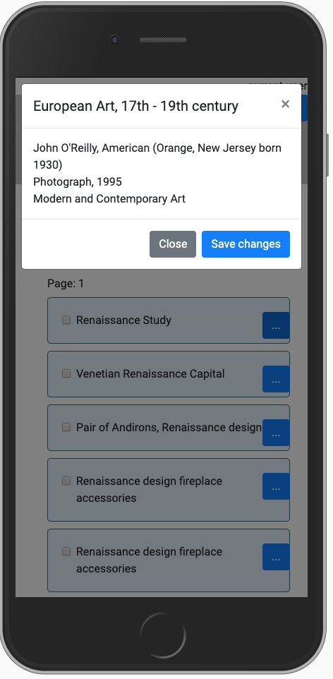
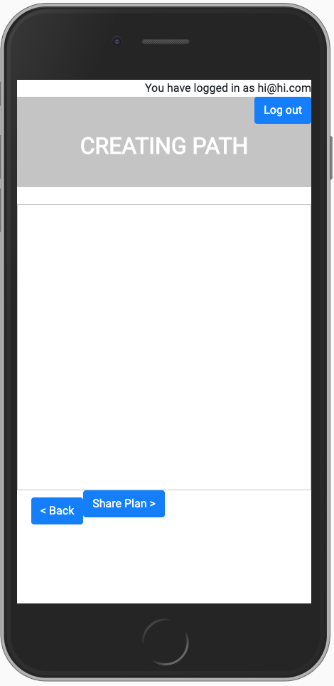
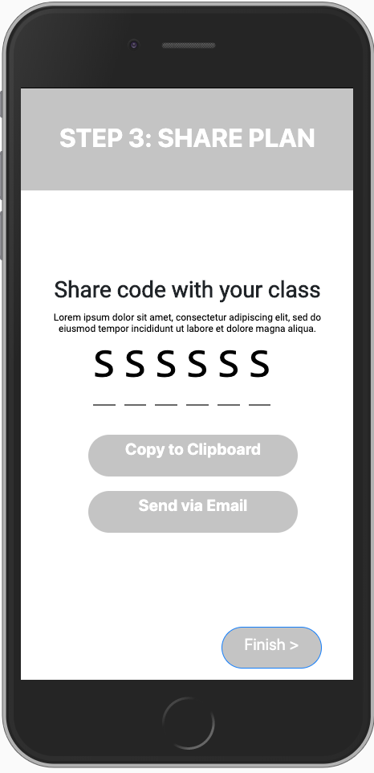
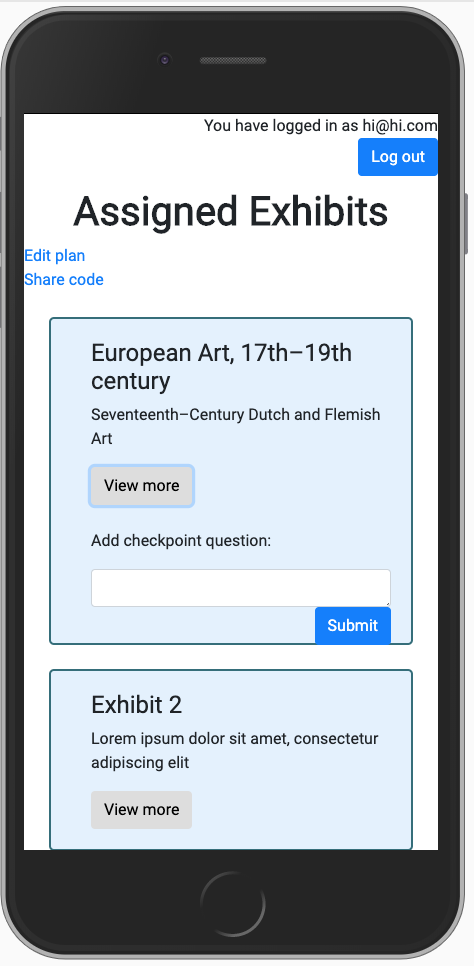
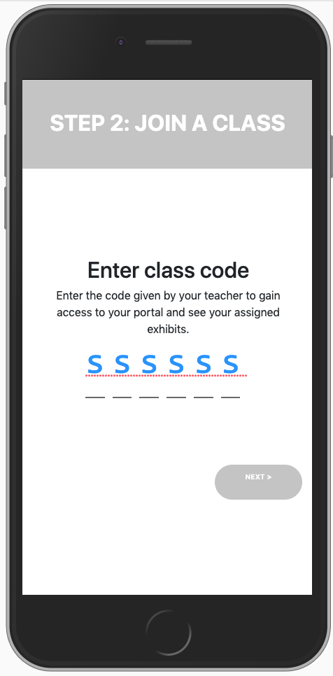
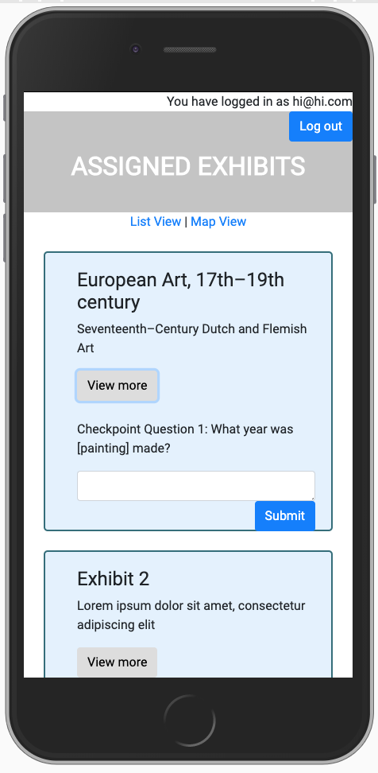

# UCSD COGS 121 Spring 2019 Project - Milestone 4
## Team name
Band of the Hawk
## Team members
Eddy Ambing
Tianyu Ma
Kenny Cheng
Andrew Auh
## Screenshots of UI

  
"Educator" Path  

  
"Student" Path  

## Improvements from Milestone 3
Since Milestone 3, many of our UI changes occurred on the Start a Plan page (educator path). While in our previous milestone, search results simply showed the first 10 items, we implemented a page system, so that users can browse through all objects with that keyword. In addition, we also wanted to give users/educators the option of viewing more details about a specific object/piece through a popup modal, which displays more information as well as an image of the object. 

## User Action 1
Users can search for pieces in the collection and view more information about specific objects.

## User Action 2
Users (educator role) can share a code with other users (student role) to access the same plan.